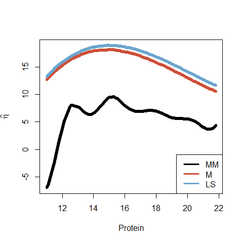
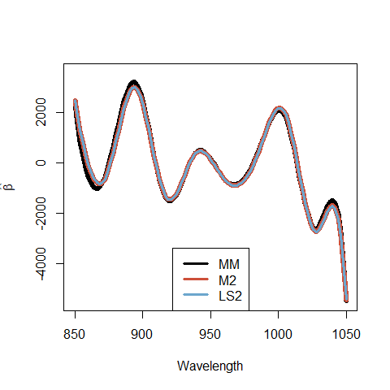

<!-- badges: start -->
[](https://travis-ci.org/anevolbap/RobustFPLM)
<!-- badges: end -->

Robust estimators for Functional Partial Linear Models
================
Matias Salibian-Barrera
2020-06-20

This repository contains `R` code to compute the robust MM-estimators
for Functional Partial Linear models in [Boente G, Salibian-Barrera M,
Vena P. Robust estimation for semi-functional linear regression models.
To appear in *Computational Statistics and Data
Science*](https://github.com/anevolbap). Original code by [Pablo
Vena](https://github.com/anevolbap).

#### Installing the `RobustFPLM` package for `R`

The package can be installed directly from this repository using the
following command in `R`:

``` r
devtools::install_github("msalibian/RobustFPLM", ref = "master")
```

### Tecator example

Because the regression model of the Tecator data includes an interaction
between the non-parametric term `g` and a scalar covariate `w`
(specifically, the model is `y = <X, beta> + w * g(z) + e`, where `X` is
the functional predictor, `w` and `z` are scalar variables, and `g` is a
smooth unknown function), setting the appropriate design matrices
(including splitting the data into a training and a testing set, and
computing the 2nd derivatives of the absorbance spectra) requires
special care. Thus, we prepared a suite of specific functions and
scripts to reproduce our analysis in the paper. See
[here](tecator-specific-functions.R) and [here](script-TECATOR.R).

### A detailed example

Here we will fit a FPLM to the
[Tecator](http://lib.stat.cmu.edu/datasets/tecator) data set. It is also
available from the [fda.usc](https://cran.r-project.org/package=fda.usc)
package.

The main function in our Robust FPLM suite of functions is
`FPLM-Bsplines()`. Its arguments include:

  - `y`: the vector of scalar responses;
  - `x`: a matrix of the functional covariates, where each row contains
    the functions evaluated on a (common) grid;
  - `t`: the grid over which the functional covariates were evaluated;
  - `u`: the values of the explanatory variable that enters the model
    non-parametrically;
  - `range_freq`: a vector of B-spline basis sizes to try for the
    functional regression coefficient;
  - `range_spl`: a vector of B-spline basis sizes to try for the
    non-parametric component;
  - `norder`: the order of the B-splines;
  - `fLoss`: the loss function to be minimized; and
  - `trace`: a logical argument indicating whether partial results are
    printed.

We load our functions from the file `FPLM-Bsplines-functions.R`. Note
that to compute the robust estimators for the FPLM model we need the
[robustbase](https://cran.r-project.org/package=robustbase) package.

``` r
library(RobustFPLM)
```

Next, we load the `tecator` data from the `fda.usc` package and extract
the response vector of fat content, the matrix of functional explanatory
functional variables (the second derivatives of the absorption spectra),
the grid (t) on which the x’s were evaluated, and the vector (u) of
protein values (the covariate that is modelled non-parametrically). The
model is `fat = < beta, absorp2> + eta(protein) + e`.

``` r
library(fda.usc)
data(tecator)
absorp2 <- fdata.deriv(tecator$absorp.fdata, nderiv = 2)
y <- tecator$y$Fat[1:155]
u <- tecator$y$Protein[1:155]
t <- absorp2$argvals
x <- absorp2$data[1:155, ]
```

We consider B-splines of order 4, with bases sizes between 4 and 13, and
use the Robust BIC criterion to determine the optimal B-splines
dimensions for each smooth component

``` r
norder <- 4
range_beta <- 4:13
range_eta <- 4:13
criterion <- "bic1"
```

Now we fit the robust MM estimator:

``` r
set.seed(124)  # for lmrob()
a <- FPLMBsplines(y = y, x = x, u = u, t = t, range_freq = range_beta, range_spl = range_eta, 
    norder = norder, fLoss = "lmrob", trace = FALSE)
```

To fit the M and LS estimators we simply change the argument `fLoss`:

``` r
d <- FPLMBsplines(y = y, x = x, u = u, t = t, range_freq = range_beta, range_spl = range_eta, 
    norder = norder, fLoss = "huang", trace = FALSE)

b <- FPLMBsplines(y = y, x = x, u = u, t = t, range_freq = range_beta, range_spl = range_eta, 
    norder = norder, fLoss = "ls", trace = FALSE)
```

The following plots compare the different fits. First we look at the
non-parametric component:

``` r
u_order <- order(u)
ma <- max(rra <- c(a$fit$eta_est, b$fit$eta_est, d$fit$eta_est))
mi <- min(rra)
plot(u[u_order], a$fit$eta_est[u_order], type = "l", xlab = "Protein", pch = 1, 
    lwd = 6, col = "black", ylab = expression(hat(eta)), lty = 1, ylim = c(mi, 
        ma))
lines(u[u_order], d$fit$eta_est[u_order], lwd = 6, col = "tomato3")
lines(u[u_order], b$fit$eta_est[u_order], lwd = 6, col = "skyblue3")
legend("bottomright", lty = 1, lwd = 3, col = c("black", "tomato3", "skyblue3"), 
    legend = c("MM", "M", "LS"))
```

<!-- -->

And finally we look at the estimates for the functional regression
coefficient:

``` r
ma <- max(rrb <- c(a$fit$slope_fun, b$fit$slope_fun, d$fit$slope_fun))
mi <- min(rrb)
plot(t, a$fit$slope_fun, col = "black", lwd = 6, type = "l", xlab = "Wavelength", 
    ylab = expression(hat(beta)), lty = 1, ylim = c(mi, ma))
lines(t, d$fit$slope_fun, col = "tomato3", lwd = 6, lty = 1)
lines(t, b$fit$slope_fun, col = "skyblue3", lwd = 6, lty = 1)
legend("bottom", lty = 1, lwd = 3, col = c("black", "tomato3", "skyblue3"), 
    legend = c("MM", "M", "LS"))
```

<!-- -->

We can now compare the fit obtained with the robust estimator to that
obtained with the `cleaned'' data, that is: we remove potential outliers
and fit the LS estimator to this`clean’’ data. To identify possibly
atypical observations, we look at the residuals from the robust fit, and
flag those with large residuals (in absolute value):

``` r
res <- y - a$fit$fitted
names(res) <- 1:length(res)
outl <- as.numeric(names(boxplot(res, col = "gray70")$out))
```

<!-- -->

We remove these suspect observations and re-fit the M- and LS-estimators
on the remaining \`\`clean’’ data:

``` r
y2 <- y[-outl]
u2 <- u[-outl]
x2 <- x[-outl, ]
d2 <- FPLMBsplines(y = y2, x = x2, u = u2, t = t, range_freq = range_beta, range_spl = range_eta, 
    norder = norder, fLoss = "huang", trace = FALSE)

b2 <- FPLMBsplines(y = y2, x = x2, u = u2, t = t, range_freq = range_beta, range_spl = range_eta, 
    norder = norder, fLoss = "ls", trace = FALSE)
```

We now plot the robust estimator computed earlier on the whole data set,
and the M- and LS-estimators re-computed on the \`\`cleaned’’ data:

``` r
u2_order <- order(u2)
ma <- max(rra <- c(a$fit$eta_est, b$fit$eta_est, d$fit$eta_est))
mi <- min(rra)
plot(u[u_order], a$fit$eta_est[u_order], type = "l", xlab = "Protein", pch = 1, 
    lwd = 6, col = "black", ylab = expression(hat(eta)), lty = 1, ylim = c(mi, 
        ma))
lines(u2[u2_order], d2$fit$eta_est[u2_order], lwd = 6, col = "tomato3")
lines(u2[u2_order], b2$fit$eta_est[u2_order], lwd = 3, col = "skyblue3")
legend("bottomright", lty = 1, lwd = 3, col = c("black", "tomato3", "skyblue3"), 
    legend = c("MM", "M2", "LS2"))
```

<!-- -->

and

``` r
ma <- max(rrb <- c(a$fit$slope_fun, b$fit$slope_fun, d$fit$slope_fun))
mi <- min(rrb)
plot(t, a$fit$slope_fun, col = "black", lwd = 6, type = "l", xlab = "Wavelength", 
    ylab = expression(hat(beta)), lty = 1, ylim = c(mi, ma))
lines(t, d2$fit$slope_fun, col = "tomato3", lwd = 6, lty = 1)
lines(t, b2$fit$slope_fun, col = "skyblue3", lwd = 3, lty = 1)
legend("bottom", lty = 1, lwd = 3, col = c("black", "tomato3", "skyblue3"), 
    legend = c("MM", "M2", "LS2"))
```

<!-- -->

Note that all estimators are now essentially identical to each other. In
other words, we see that the robust estimator results in a fit that is
intuitively equivalent to using LS on a \`\`cleaned’’ data set. However,
the robust procedure accomplishes this automatically, and does not
involve diagnostic plots or manually removing observations from the data
set.
